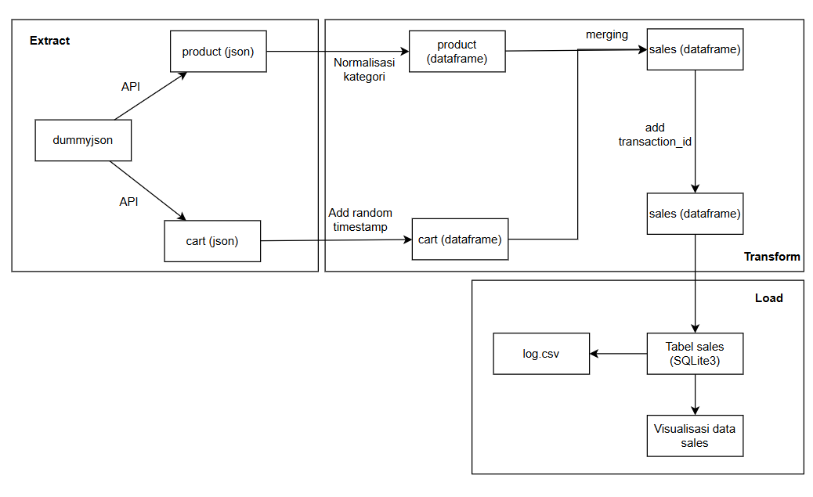

# Gramedia Ecommerce ETL
## Setup
Run
```bash
pip install -r requirement.txt
py ETL.py
```

## Description of ETL Logic
### Source data
Data yang digunakan bersumber dari https://dummyjson.com/products dan https://dummyjson.com/carts. Karena data carts tidak memiliki transaction_date, maka tanggal transaksi digenerasi secara acak berdasarkan nilai carts_id. Rentang waktu yang digunakan untuk generasi tanggal adalah 1 Oktober 2025 sampai 31 Oktober 2025. Secara otomatis, timestamp data transaksi memiliki timezone yang konsisten, yaitu WIB.

## Transformasi data
Normalisasi kategori produk dilakukan dengan menggunakan fungsi 'astype('category').cat.codes' dengan pemetaan category sebagai berikut:
| ID  | Category Name          |
|-----|-----------------------|
| 1   | beauty                |
| 2   | fragrances            |
| 3   | furniture             |
| 4   | groceries             |
| 5   | home-decoration       |
| 6   | kitchen-accessories   |
| 7   | laptops               |
| 8   | mens-shirts           |
| 9   | mens-shoes            |
| 10  | mens-watches          |
| 11  | mobile-accessories    |
| 12  | motorcycle            |
| 13  | skin-care             |
| 14  | smartphones           |
| 15  | sports-accessories    |
| 16  | sunglasses            |
| 17  | tablets               |
| 18  | tops                  |
| 19  | vehicle               |
| 20  | womens-bags           |
| 21  | womens-dresses        |
| 22  | womens-jewellery      |
| 23  | womens-shoes          |
| 24  | womens-watches        |

Data product dan sales digabung dengan melakukan inner join pada kolom product_id. Transaction_id digenerasi secara incremental dengan urutan berdasarkan transaction_date dan category_id.

## Load data
Database yang digunakan berbasis SQLite3. Pada database Ecommerce, terdapat 2 tabel, sales dan category. Tabel category menampung pemetaan category_id dan category, sedangkan tabel sales menampung data transaksi yang sudah diproses.

Pada saat dilakukan load ke tabel sales, apabila terdapat data yang tidak valid, maka proses load dibatalkan dan pesan error akan ditampilkan. Proses pemasukan data ke database menggunakan skema delete-insert. Status proses ETL serta timestamp ditampung di log.csv

## Visualisasi data
visual.ipynb menampung 2 visualisasi data transaksi, total_sales per tanggal dan total_sales per category.

## Explanation of Data Validation
Proses validasi data dilakukan dengan mendefinisikan struktur tabel di SQL, sehingga data yang dimasukkan sesuai dengan constraint yang berlaku pada tabel. 

```SQL
CREATE TABLE IF NOT EXISTS sales (
    transaction_id INTEGER PRIMARY KEY,
    product_id INTEGER NOT NULL,
    product_name TEXT NOT NULL,
    category INTEGER,
    quantity INTEGER CHECK(quantity > 0), 
    price REAL NOT NULL CHECK(price > 0),
    total_sales REAL,
    transaction_date TEXT
)     
```
Apabila pada proses load terdapat data yang tidak valid, pesan error akan ditampilkan. Pengecekan validasi dapat dilakukan dengan menghapus komentar di fungsi Load bagian Validation test

## Diagram ETL

